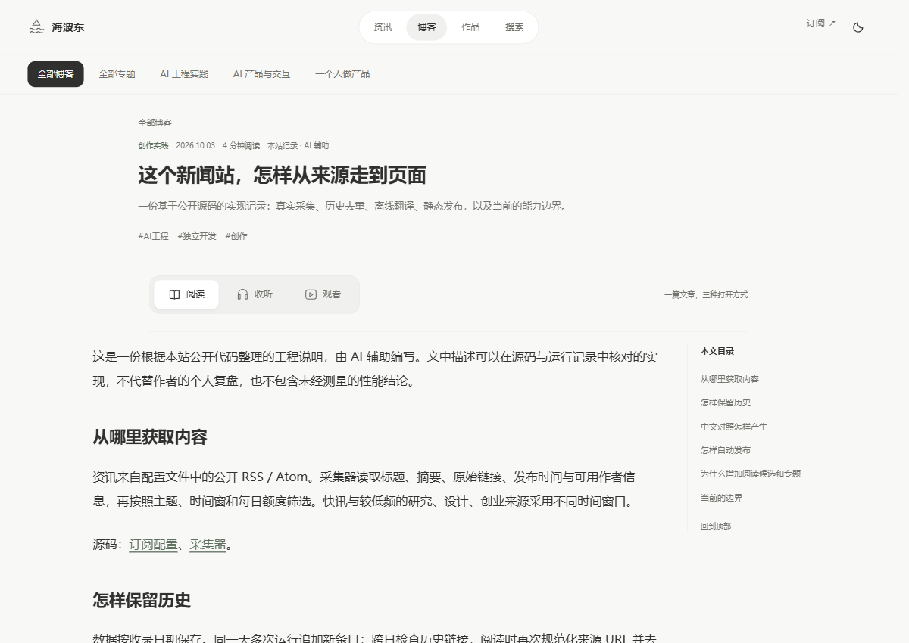
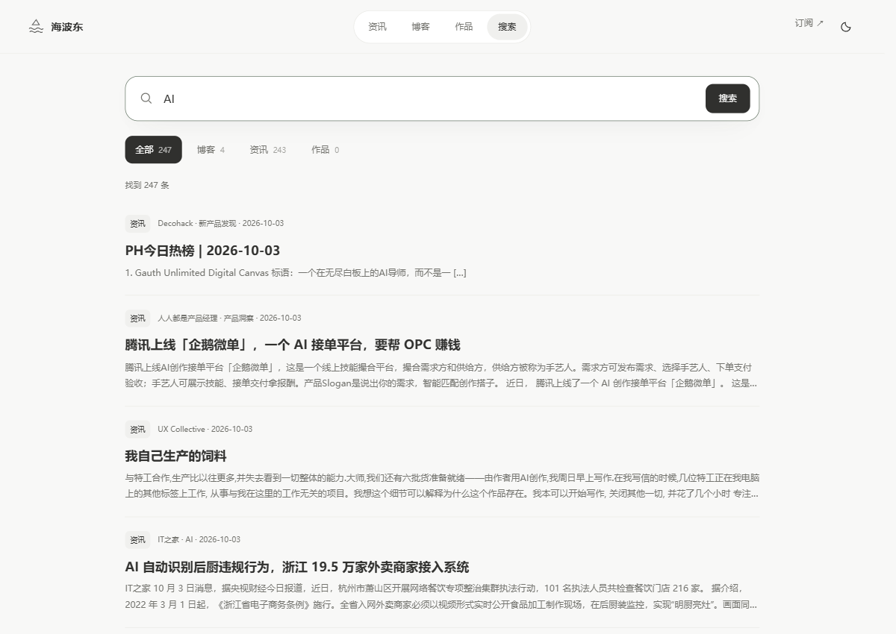
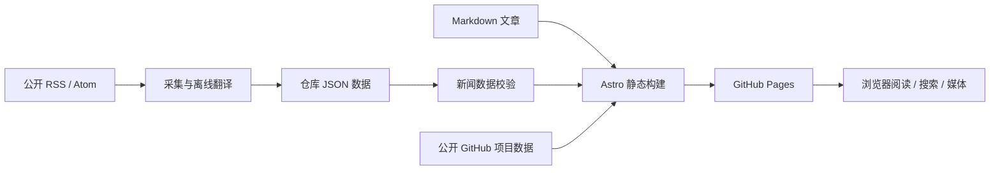

<p align="center"><sub>海波东 · 工程与思考</sub></p>

<h1 align="center">mind</h1>

<p align="center"><strong>把资讯、工程记录与作品，放进一个安静的阅读空间。</strong></p>

<p align="center">中文个人博客与资讯阅读站 · Astro 静态构建 · Markdown 写作 · GitHub Pages 发布</p>

<p align="center">
  <a href="https://ma1203580780.github.io/mind/"><strong>访问站点 ↗</strong></a> ·
  <a href="#快速开始">本地运行</a> ·
  <a href="#技术架构">技术架构</a> ·
  <a href="#文档导航">维护文档</a>
</p>

<a href="https://ma1203580780.github.io/mind/">
  <picture>
    <source media="(prefers-color-scheme: dark)" srcset="docs/assets/readme/home-dark.png">
    
  </picture>
</a>

<p align="center"><sub>真实页面截图 · 浅色与深色首页随显示主题切换 · 内容会随采集更新</sub></p>

## 为阅读而组织

mind 将公开资讯、个人文章与作品入口放在同一个站点中。首页从近期收录中按规则选出阅读候选；博客承载工程与思考；作品页连接 GitHub 项目与技术专栏。内容保存在仓库，构建后即可作为静态网站发布，无需自建数据库或常驻应用服务器。

| 发现资讯 | 阅读文章 | 看见作品 |
| --- | --- | --- |
| 主题、语言与日期筛选；历史分页；中英对照；保留原文出处。 | Markdown 正文、章节目录、代码复制与阅读进度；阅读／收听／观看切换。 | GitHub 项目与看云专栏入口；三个持续专题连接文章、资讯与作品。 |
| [浏览资讯 ↗](https://ma1203580780.github.io/mind/news/) | [浏览博客 ↗](https://ma1203580780.github.io/mind/archive/) | [浏览作品 ↗](https://ma1203580780.github.io/mind/lab/) |

### 从浏览，到深入

<table>
  <tr>
    <td width="50%"></td>
    <td width="50%"></td>
  </tr>
  <tr>
    <td><strong>专注正文</strong><br>单列阅读区域与侧边目录，支持设备中文朗读及文章媒体。</td>
    <td><strong>找回内容</strong><br>浏览器内检索文章全文、历史资讯和作品，先筛选，再分页。</td>
  </tr>
</table>

- **有出处的资讯**：公开 RSS / Atom 采集，保留原始标题、摘要、链接与时间；英文内容提供标注来源的中文译文。每条资讯有独立阅读地址。
- **可持续的内容组织**：分类、标签、归档与持续专题；正式文章、资讯、阅读候选及全站更新的 RSS 入口集中在[订阅页](https://ma1203580780.github.io/mind/subscribe/)。
- **适应不同阅读习惯**：深浅色切换、移动端布局、键盘操作与减少动态效果；未配置音频时可使用浏览器系统朗读，B 站播放器按需加载。
- **可检查的发布链路**：新闻数据校验、自动化测试与静态构建接入 GitHub Actions；信息源状态可在站点查看。

> 自动候选不等于作者推荐，机器翻译不替代原文核对。示例文章明确标注「示例稿」，不进入正式文章 RSS 与 sitemap，文章页带 `noindex`。

## 快速开始

使用 **Node.js 24**（与发布工作流一致）及 npm，在终端执行：

```bash
git clone https://github.com/ma1203580780/mind.git
cd mind
npm ci
npm run dev
```

打开终端输出的地址，默认入口为 [localhost:4321/mind/](http://localhost:4321/mind/)。本地预览使用仓库已有内容，无需配置翻译服务或统计账号。

| 命令 | 用途 |
| --- | --- |
| `npm run dev` | 启动开发服务 |
| `npm run build` | 先校验新闻数据，再生成 `dist/` 静态站点 |
| `npm run preview` | 本地预览已构建的 `dist/`，需先运行构建 |
| `npm run news:validate` | 单独校验新闻数据 |
| `npm run test:news` | 运行新闻校验与资讯列表测试 |
| `npm run write` | 启动本机写作预览，绑定 `127.0.0.1:4321` |
| `npm run test:writing` | 检查正文上传图片的部署路径处理 |

## 写作与发布

### 写下一篇文章

在 `src/content/posts/` 新建 `.md` 文件，填写 frontmatter，再写正文：

```yaml
---
title: "文章标题"
description: "准确、简洁的摘要"
date: 2026-10-03
category: "AI 工程"
tags: ["AI工程"]
draft: false
demo: false
---
```

`draft: true` 不生成生产文章页面，也不进入列表、搜索、RSS 或 sitemap；本地开发模式可通过文章地址预览草稿。`demo: true` 用于公开的排版示例。草稿文件仍在公开仓库中，请勿存放私人资料。

Windows 用户也可打开 [`mind-writing.code-workspace`](mind-writing.code-workspace)，使用 Front Matter CMS 在 VS Code 内填写文章字段、插入图片并预览。完整流程见 [Windows 写作指南](docs/WRITING_WINDOWS.md)。

站名、简介与社交入口从 [`src/site.ts`](src/site.ts) 修改，关于页文字需同步编辑。封面、音视频与 B 站配置见[写作与媒体指南](docs/AUTHORING.md)，文章结构可参考[写作提纲](docs/WRITING_TEMPLATES.md)。

### 发布到 GitHub Pages

1. 在仓库 **Settings → Pages → Build and deployment** 中将 Source 设为 **GitHub Actions**。
2. 推送到 `main`，或手动运行 [Publish blog](https://github.com/ma1203580780/mind/actions/workflows/deploy.yml)。
3. 等待构建与部署完成，再访问 [ma1203580780.github.io/mind/](https://ma1203580780.github.io/mind/)。

工作流从 Pages 配置读取域名与项目路径，并部署 `dist/`。本地默认配置为 `https://ma1203580780.github.io` + `/mind`；可通过 `SITE_URL` 与 `BASE_PATH` 覆盖。自定义域名在 Pages 中配置并完成 DNS 设置后，重新运行发布。

资讯另有每日三次的计划采集；手动运行工作流也会采集。普通推送只执行测试、项目数据刷新和构建发布，提交消息包含 `[collect-news]` 时才额外采集。详见[新闻编辑规则](docs/NEWS_EDITORIAL.md)。

## 技术架构

Astro 7.3.5 · TypeScript · Markdown · 原生 CSS / 浏览器脚本 · Python 采集与离线翻译。



| 位置 | 职责 |
| --- | --- |
| [`src/content/posts/`](src/content/posts/) · [`src/content.config.ts`](src/content.config.ts) | 文章与 frontmatter 数据约束 |
| [`src/pages/`](src/pages/) · [`src/layouts/`](src/layouts/) · [`src/components/`](src/components/) | 页面路由、站点框架与阅读组件 |
| [`src/lib/`](src/lib/) · [`src/scripts/`](src/scripts/) · [`src/styles/`](src/styles/) | 内容组织、浏览器交互与视觉样式 |
| [`src/config/`](src/config/) · [`src/data/`](src/data/) | 信息源、编辑配置、统计配置与已采集内容 |
| [`scripts/`](scripts/) · [发布工作流](.github/workflows/deploy.yml) | 采集、翻译、校验、测试与部署 |
| [`public/media/`](public/media/) · [`videos/mind-reading-films/`](videos/mind-reading-films/) | 文章媒体与示例视频源工程 |

访问统计采用 Vercount，并配置了 Umami；Clarity 项目 ID 当前为空，尚未接入。统计支持 DNT、主动关闭与站长设备排除；Clarity 接入后仍需访客明确同意才加载。公开统计页提供计数与分析入口，详细报表需登录对应服务。配置和验收方法见[统计文档](docs/ANALYTICS.md)。

## 文档导航

| 你想做什么 | 从这里开始 |
| --- | --- |
| 写文章、配封面或音视频 | [写作与媒体](docs/AUTHORING.md) · [内容提纲](docs/WRITING_TEMPLATES.md) |
| 在 Windows 上可视化写作与预览 | [VS Code + Front Matter](docs/WRITING_WINDOWS.md) |
| 维护资讯来源与翻译 | [新闻编辑规则](docs/NEWS_EDITORIAL.md) · [来源扩展](docs/SOURCE_EXPANSION.md) |
| 调整导航、专题与阅读候选 | [导航规范](docs/NAVIGATION.md) · [阅读与作品维护](docs/DISCOVERY.md) |
| 核对图片、排版与统计 | [视觉编辑规范](docs/VISUAL_EDITORIAL.md) · [统计接入](docs/ANALYTICS.md) |
| 维护本页的设计与截图 | [README 设计记录](docs/README_DESIGN.md) · [截图说明](docs/assets/readme/README.md) |

## 贡献与后续方向

欢迎通过 [Issues](https://github.com/ma1203580780/mind/issues) 提交问题或改进建议，通过 [Pull Requests](https://github.com/ma1203580780/mind/pulls) 提交修改。问题请附页面地址、复现步骤与设备环境；界面改动请附桌面／移动端截图，内容修订请附原始出处。

提交前运行 `npm run test:news` 和 `npm run build`；涉及采集、翻译时补跑 `python -m unittest discover -s scripts -p 'test_*news.py'`（CI 使用 Python 3.12）。更多专项测试见[发布工作流](.github/workflows/deploy.yml)。

仓库已有记录中的后续事项，尚未完成，也未承诺排期：

- [ ] 补充作者确认的真实实测、个人观点与文章媒体。
- [ ] 为作者精选配置已确认的条目与推荐理由，当前列表为空。
- [ ] 完成 Clarity 项目绑定与访客同意流程验收。

当前以 Markdown 文件、VS Code 内的 Front Matter CMS 和 GitHub 发布流程维护内容，无在线 CMS 服务、邮件订阅后台或跨设备阅读同步。仓库尚未提供根目录开源许可证；第三方文章、图片及视频的权利归原作者，使用时请核对授权。

---

<p align="center">海波东 · 工程与思考<br><a href="https://ma1203580780.github.io/mind/">开始阅读 ↗</a></p>
