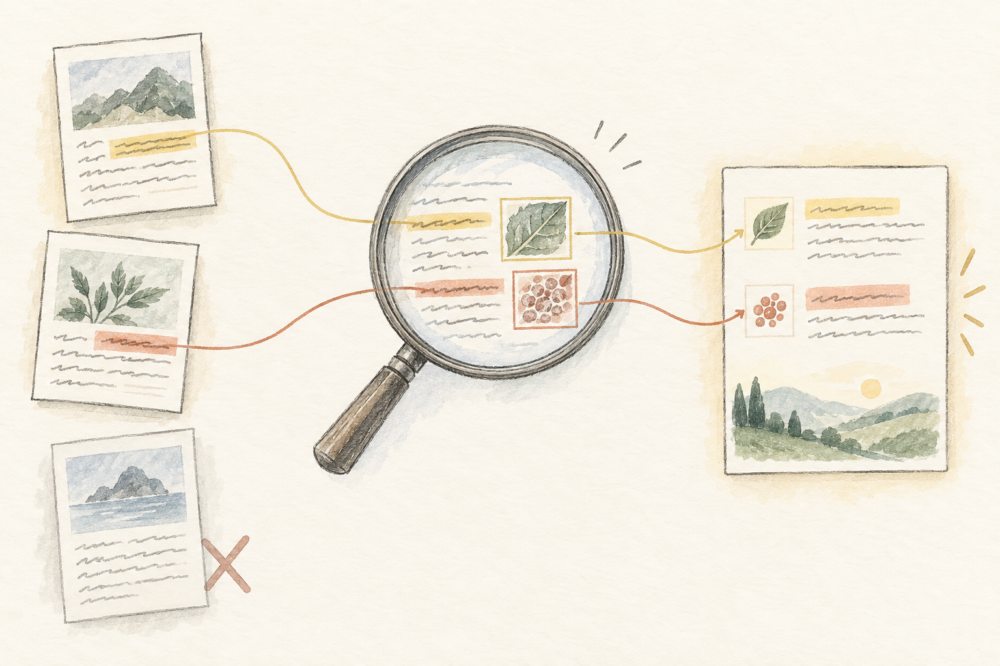

<!-- a2ui:Thesis -->
**先判断答案需要覆盖多少材料，再选择怎么读。** 查一个操作步骤，找到足够证据就能回答；统计“全部”“最多”“还有没有”，必须交代搜索范围和遗漏。2026 年值得关注的进展，是让模型安排阅读、调用计算、核对缺口。真正的进步要落到证据覆盖，而不只是换一个架构名字。

<!-- a2ui:Chapter -->
## 01 / 重新定义问题 / 相关的材料，不一定够回答

同一个知识库，换一种问法，就可能需要另一套处理流程。

<!-- a2ui:Prose -->
“RAG 不准，换个 embedding。”这个建议有时对，但太早了。我们还没确认：这道题到底是要找一句话，拼几处依据，还是检查整个资料库。

假设我有一批个人 AI 笔记。问“RRF 是什么”，可以找到定义再解释。问“我对 Agent 记忆的看法发生过哪些变化”，需要沿时间找出前后说法。问“这批笔记里，哪类失败出现最多”，就不能拿最相似的五篇代替全部记录。

前两种回答可以靠一组充分的证据成立。第三种包含总体判断：没读到的材料也会改变排名。**相关性回答“哪些值得先看”，完整性回答“哪些不能漏看”。** 两件事不能共用一个相似度分数交差。

<!-- a2ui:EvidenceTable -->
### 先按问题结构选路线

| 问题结构 | 典型问法 | 起步方案 | 需要额外证明什么 |
| --- | --- | --- | --- |
| 局部事实 | 2.4 版离线能否导出正文？ | 带版本条件的关键词与语义检索 | 原文适用于这个版本与环境 |
| 跨处拼接 | 正文和图片怎样一起迁移？ | 检索后按证据缺口补查 | 每个必要步骤都有支持 |
| 全集聚合 | 哪类问题最多？列出所有例外 | 枚举范围、逐项抽取、程序聚合 | 覆盖范围、去重方式、缺失项 |
| 比较与演变 | 三次修改中，观点如何变化？ | 按对象与时间取齐材料，再对照 | 版本顺序及观点变化的依据 |

这是本文的工程选型框架，不是行业统一分类。一个复杂请求也可能拆成几种子问题。

<!-- a2ui:Prose -->
### 一个很小、但能卡住 Top-k 的例子

附录语料有 8 条自造记录：RAG 相关 3 条，Memory 相关 3 条，Cost 相关 2 条。其中 N2 是 N1 的修订，不能算成另一篇独立笔记。按文章身份去重后，实际是 **RAG 2 篇、Memory 3 篇、Cost 2 篇，共 7 篇**。

现在问：“哪类笔记最多？”如果检索恰好返回三个带 RAG 标签的片段，它们可以全部相关、全部真实，最终结论仍然错。把这三段重排得更漂亮也没用，缺的不是排序精度，是总体分母。

进一步问：“有没有从未出现过的问题类型？”仅凭这 8 条，只能回答这份快照中有哪些或没有哪些；不能替未来记录、未同步的文件或者所有个人知识作保证。全称判断必须带边界。

[GlobalQA](https://arxiv.org/abs/2510.26205v2)把计数、极值、排序和 Top-k 抽取单独作为全库推理任务评测。它提醒我：有些失败来自题型与检索目标不匹配。本文的小语料是自造反例，没有复现该论文的实验，也不据此估计真实系统准确率。

<!-- a2ui:Caveat -->
### “没搜到”不能直接写成“没有”

“没找到反例”可能只是检索遗漏；“这个固定快照里没有反例”，需要枚举和检查记录。开放网页通常无法穷尽，这时更诚实的结论是“在所查来源中未发现”，并交代范围。

把可回答的问题答窄一点，常常比加一句“请不要幻觉”更有效。

<!-- a2ui:Chapter -->
## 02 / 研究带来的变化 / 把阅读变成可安排的过程

长上下文提供容量；检索安排入口；程序与分步阅读处理覆盖和计算。它们可以一起用。

<!-- a2ui:Prose -->
### RLM 给我的启发：材料可以放在工作环境里

[Recursive Language Models，2026 年 5 月修订版](https://arxiv.org/html/2512.24601v3)把长输入放到外部执行环境中，由模型用代码查看、拆分，并对子片段调用模型。这里的关键变化是按需处理材料，不要求每次都把全文装进一次调用。

论文的 OOLONG-Pairs 表中，GPT-5 基础方式得分 0.1，深度 1 的 RLM 得分 58.0；但同表 CodeQA 上，深度 2 为 66.0，深度 3 降到 58.0。四项任务和指定模型配置的结果不能当成通用排名；作者也指出子调用成本可能失控。[数据与限制见表 1、§7](https://arxiv.org/html/2512.24601v3)。

我的判断是：值得借鉴的是阅读与计算的组织方式，不能据此推导“递归越深越聪明”。若问题只需要一段明确说明，多层调用可能只增加等待和排错成本。

<!-- a2ui:SplitCompare -->
### 两个问题，可以用同一库、不同的读法

#### 问操作：先定位，再补齐

沿用一个自造软件例子：D1 说 2.4 版能离线导出 Markdown 正文，但不含图片；D2 说 3.1 版可联网打包；D3 说 2.4 版的图片需连同 assets 目录复制。

问“旧版离线怎样带走正文和图片”，最小充分证据是 D1 与 D3。先查旧版导出，再沿图片缺口补查。D2 可以说明版本差异，不能充当本题操作依据。

#### 问统计：先定范围，再汇总

问“这 8 条记录里哪类最多”，先列出 8 个 ID，处理 N1/N2 的版本关系，再统计 7 个独立对象。

若主题来自自然语言，模型可逐条判断主题，但计数交给程序；不确定的主题单列待核对。输出同时给出计数、纳入的 ID 和排除原因，读者才有办法检查分母。

<!-- a2ui:Prose -->
### 四种实现，什么时候值得用

**静态 RAG** 适合证据集中、查询量较大、时延敏感的事实查询。先把版本和原文边界处理好；关键词和语义检索互补，融合负责扩大候选，精排负责在候选中选择。它们都不能找回根本没进入索引的文档。

**长上下文直读** 是小而边界清楚的资料集应保留的基线。若全文能舒适地放入窗口，直接读也许比维护一套索引更合算。要测的是最终任务质量、价格和等待，而不是把“用到了 RAG”当成设计目标。装得下也不保证能正确比较、计数和处理冲突。

**Agentic RAG** 让第一次检索的结果影响下一次查询。它适合需要补条件、追引用、跨资料找联系的题。相应代价是多轮费用和路径波动，所以每一轮都应对应一个尚未解决的缺口。

**程序化阅读或 RLM 类方式** 适合材料很长、要遍历或聚合的任务。先用程序枚举、过滤、分组；需要语义判断时再调用模型。模型不应在心里估计一堆数字，也不应凭搜索片段猜“全部”。对于已经结构化的数据，直接查询和计算往往就够了。

这些选择的分界不只是 token 数。还包括材料是否稳定、是否要全量覆盖、每步是否可检查，以及一次误答会造成多大返工。

<!-- a2ui:Flow -->
### 我会让阅读流程留下四样东西

| 阶段 | 留下的产物 | 下一步的门槛 |
| --- | --- | --- |
| 定范围 | 快照 ID、对象清单、版本与排除项 | 要回答的是哪一批材料？ |
| 列缺口 | 必需结论及缺失依据 | 还缺哪个条件或对象？ |
| 读与算 | 原文位置、抽取记录、计算输入输出 | 每个结果能否重算回查？ |
| 核对 | 支持关系、未覆盖项、预算状态 | 可以回答，还是必须收窄？ |

这个流程同时适用于一次检索和多轮 Agent。多走一轮的理由应该是补具体缺口，不是“再想一想”。

<!-- a2ui:Prose -->
### 用一张证据账代替一堆“相关片段”

对旧版导出题，我会维护三行：正文方法 → D1；图片方法 → D3；版本/联网边界 → D1 与 D2 的差异。只要图片行还是空的，就不能把整体任务标为完成。对统计题，账本则变成“纳入对象、版本、主题、抽取依据、是否已处理”。

一个最小的实现甚至不需要向量库：文件清单负责范围，搜索负责定位，结构化表负责记账，程序负责汇总。先把每一步留下来，再判断是否需要更复杂的索引或调度。

分块仍然要保住限定条件。[Contextual Retrieval](https://www.anthropic.com/engineering/contextual-retrieval)在索引前给片段补入文档背景，处理孤立片段难理解的问题。我的使用原则是把“模型补的背景”与原文分开：它帮助搜索，最终引用仍须落到可核对的原句。

<!-- a2ui:Figure -->

AI 生成的关系示意，不是实验结果。对操作题，D1 与 D3 可以构成充分证据；对全库统计题，几条引用不能替代对象清单与覆盖记录。

<!-- a2ui:FailureCase -->
### 把八段分别摘要，再总结摘要，仍然可能漏掉答案

如果第一层只保留“主要观点”，N2 取代 N1 的关系可能在摘要时消失。第二层再聪明，也只能看到八份互不关联的短文。

因此，分步阅读要先规定中间结果保留什么。计数题保存对象 ID、版本和类别；比较题保存差异及原文位置；操作题保存前提、动作和例外。**压缩是否成功，要看下一步需要的信息是否仍在。**

<!-- a2ui:Chapter -->
## 03 / 怎样验证 / 先让系统通过一个可解释的小测验

把检索、证据使用、完整性分开测。小样本用于找错，不用来制造漂亮准确率。

<!-- a2ui:EvidenceTable -->
### 六类题，分别暴露六种短板

| 题型 | 自造语料中的检查 | 失败后优先排查 |
| --- | --- | --- |
| 直接事实 | D1 是否支持离线导出正文 | 解析、索引、查询条件 |
| 跨处依据 | 正文和图片是否同时有来源 | 证据集合是否完整 |
| 错版干扰 | 加入 D2 后是否混用 3.1 功能 | 适用性与冲突处理 |
| 修订去重 | N1/N2 是否只算一个对象 | 身份、版本、去重规则 |
| 全库聚合 | 是否得出 2、3、2，共 7 篇 | 范围枚举和程序聚合 |
| 无答案 | 未提供耗时时是否拒绝编造分钟数 | 无依据细节与收窄回答 |

<!-- a2ui:Experiment -->
### 用三条路线跑同一套题

1. 固定资料快照和题目，先人工写出必要结论、至少一组充分证据、不能说的内容。统计题另附全部对象清单。
2. 建三个基线：全文直读；一次检索再回答；可按缺口补查的阅读流程。固定模型与验收条件，分别保存实际输入、费用和输出。
3. 对失败题做一次“直接给正确证据”的诊断。给齐后能答对，说明取材链路值得先修；仍答错，就查条件理解、抽取与汇总。
4. 再放入错误版本或等长度中性材料，并交换证据顺序。这样才能初步区分资料不够、干扰和位置变化。
5. 用原题的改写、不同版本和新的计数范围复测。每题保留多次运行，别只截一次正确答案。
6. 先报错误清单与逐题轨迹；积累足够样本后，再分题型报告质量、完整覆盖、费用和时延。

<!-- a2ui:Prose -->
### 要测“同时拿齐”，不能只测“至少命中”

假设五道题都需要两份材料，系统每题只拿到其中一份。“至少命中一条”的比例可以是 100%，完整证据覆盖却是 0%。它看起来很会搜，实际无法支持完整答案。

对有多种正确证据组合的题，满足任意一组充分组合即可，不必强迫命中某个固定文档 ID。答案端再逐条检查结论是否被引用支持、是否漏前提。检索分数和答案分数要并排看。

全库任务还要增加一个单独的覆盖记录：预期 8 条，成功读取几条，解析失败几条，去重后几个对象。解析失败不能悄悄从分母消失；部分覆盖时输出也要标为部分结果。

<!-- a2ui:Checklist -->
### 做完后，应当能交出这些材料

- 本次语料的范围、快照和版本规则。
- 问题需要的结论，以及尚未补齐的证据。
- 实际送给模型的文本，而不只是检索候选日志。
- 统计或排序的中间记录，能够重算最终数字。
- 按题型列出的失败、重复运行波动与费用。
- 到预算上限时的已知、未知和未检查范围。

<!-- a2ui:Takeaway -->
## 先让答案有来路，再让阅读有章法

我现在更愿意把 RAG 看成一套阅读安排：先界定问题要覆盖的材料，再决定检索、通读、分步调用与程序计算怎样配合。局部题守住充分证据；整体题守住范围和遗漏；多轮流程守住每一步为什么继续。

下一次遇到“不准”，先抽一道失败题，写出它真正需要的证据集合。如果缺的是总体分母，调 reranker 很难解决；如果只有一条明确事实，也没有必要先搭一个复杂 Agent。架构选择应该由具体缺口来推动。

<!-- a2ui:SourceNotes -->
## 研究来源、练习材料与边界

核对日期：2026-10-04。本文保留个人笔记中对 RAG、RRF 与精排的关注，主体已扩展为阅读流程与完整性问题。研究描述与本文建议分开；所有 D/N 编号材料为自造数据，没有真实模型成绩。

- [RLM，v3，2026-05-11](https://arxiv.org/abs/2512.24601v3)：方法与结果以该版本为准，不把特定任务增益推广到所有知识库。
- [GlobalQA，v2，2025-11-04](https://arxiv.org/abs/2510.26205v2)：用于区分局部与全库题型。
- [Contextual Retrieval，2024-09-19](https://www.anthropic.com/engineering/contextual-retrieval)：片段保留语境的工程参考，不是 2026 年的新发现。

可直接使用：[8 条笔记与 3 份操作材料](../../../public/articles/research/examples/rag-fixture.json)、[练习说明](../../../public/articles/research/examples/README.md)、[参考计算与校验脚本](../../../public/articles/research/examples/reference_checks.py)。脚本只验证自造例子的确定性答案，不模拟或测量 LLM；真正的效果仍需运行上面的对照实验。
